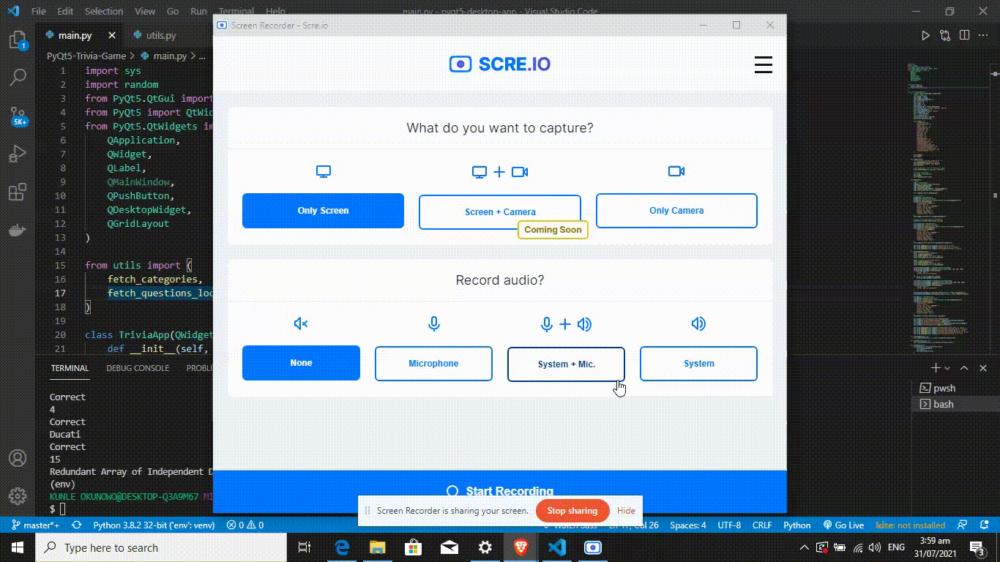

## PyQt-based Trivia Game    
This app was developed primarily for learning purposes. I'm currently working on re-writing in C++ and adding extra-features for timing each question, and a local database for storing highscores. The questions were fetched from the [Open Trivia Database API](http://opentdb.com/) and stored locally in .yaml files for each category.

## App structure 
- `main.py` - Contains the main PyQt5 app 
- `utils.py` - Contains the backend for fetching questions for each category
- `/questions` - Contains all the questions (i.e. {category_id}.yaml)
- `assets/categories.yaml` - Contains a dictionary of all the category names and ids 

## Running the app

### Pre-requisites 
- Python 3.xx installed     
- Python package manager (pip)

### Steps
- Clone the repository 
```bash 
$ git clone https://github.com/rexsimiloluwah/PyQt5-Trivia-Game.git
```
- Create a virtual environment [OPTIONAL]
```bash 
$ python -m venv env
$ source activate env/Scripts/activate
```
- Install the required packages and dependencies 
```bash
$ pip install -r requirements.txt
```
- Run the application
```bash
$ python main.py
```



### To download the executable file and install on your systems 
